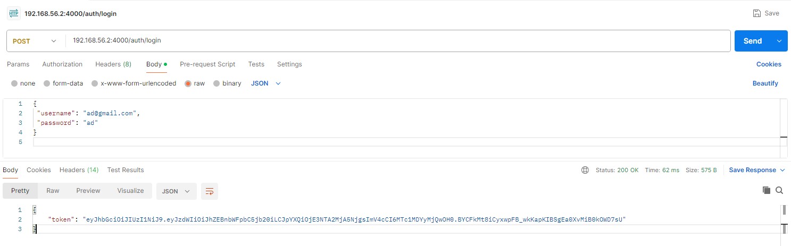
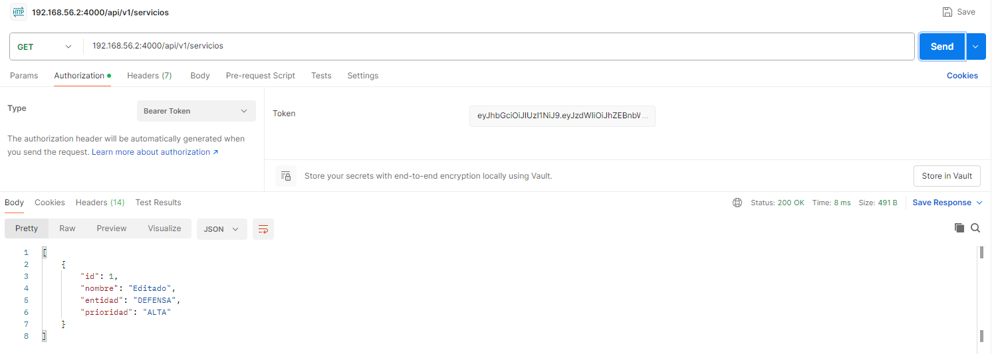
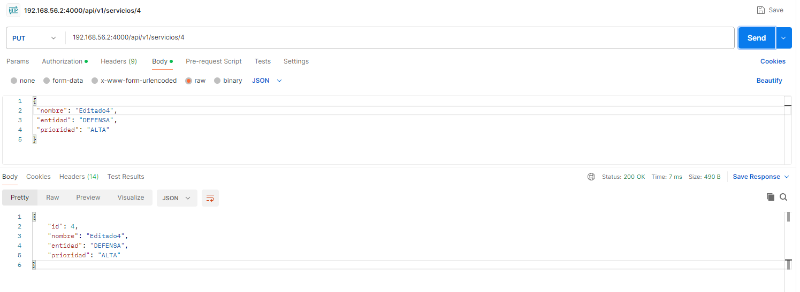
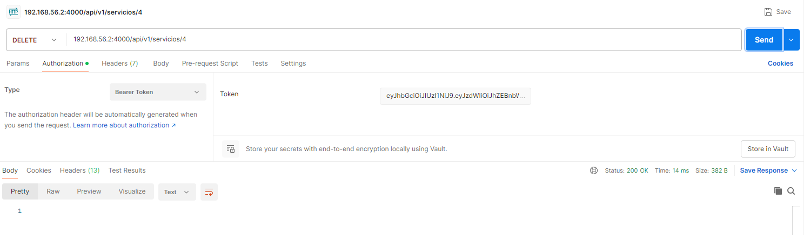

# API-CRUD


# Paso 1 - Iniciar sesion para generar el token del usuario 
<br>



<br>

# Paso 2 - Peticion GET servicios disponibles
- En el apartado de Authorization -> bearer token - Colocar el token generado en /login para poder llamar mediante una peticion GET a los servicios disponibles 


<br>



<br>

# Paso 3 - Nuevo servicio POST
- Agregar un nuevo servicio mediante Peticiones POST y agregando un cuerpo en Body de tipo JSON

```cmd
{
 "nombre": "Ciberseguridad",
 "entidad": "DEFENSA",
 "prioridad": "ALTA"
}

```

<br>


<br>


<br>



<br>


<br>



<br>


